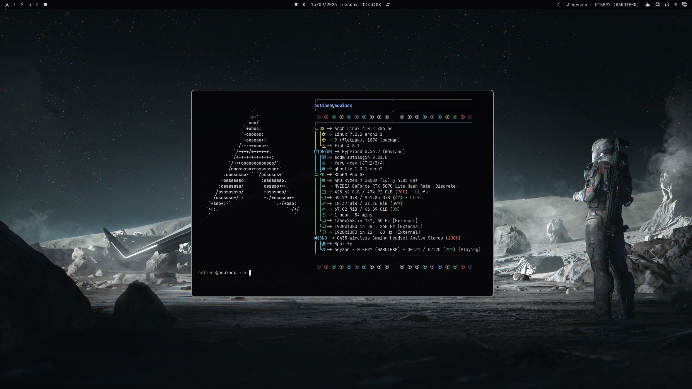
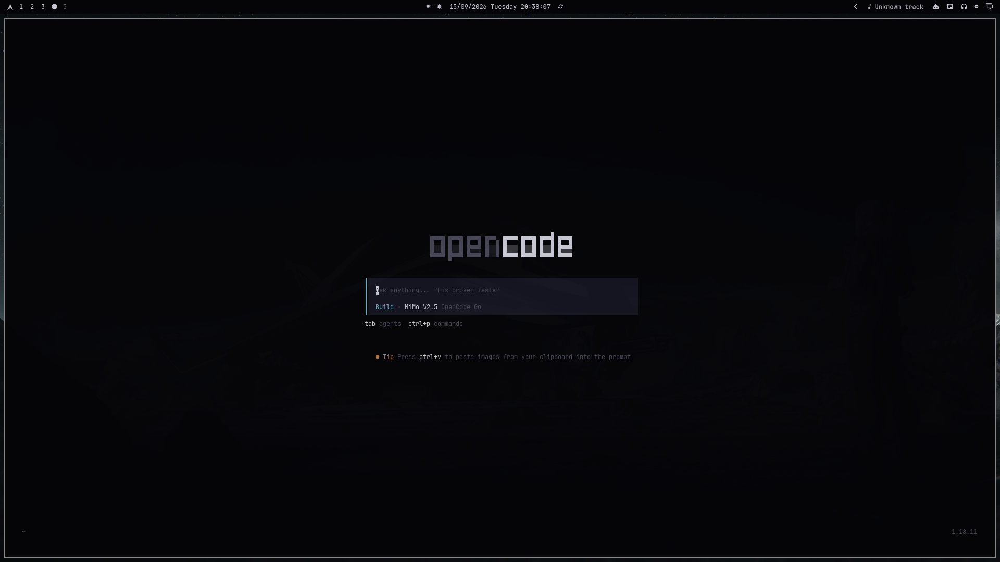
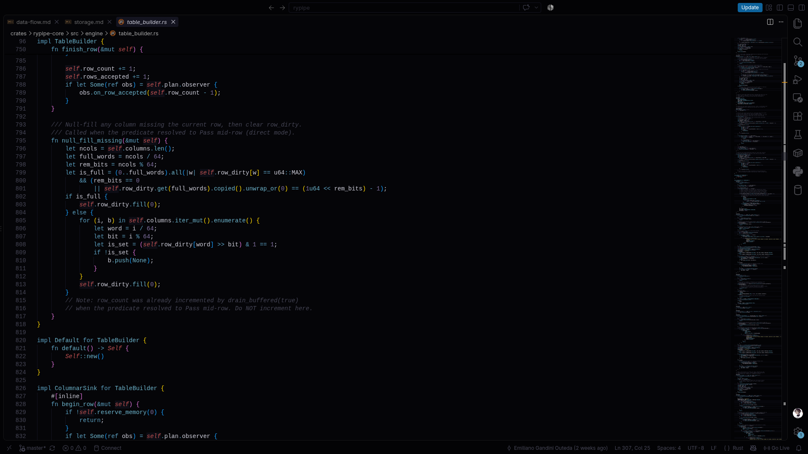
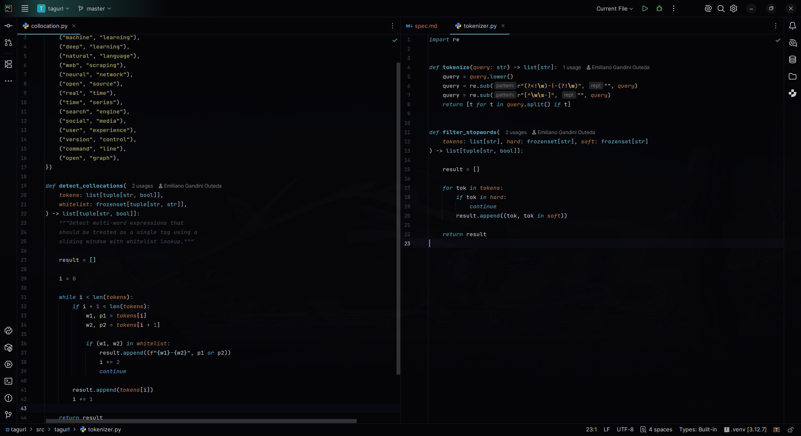

# Titan Black

Vanta Black-based dark theme with cool sci-fi accents for Hyprland, opencode, VS Code, and PyCharm.

Inspired by deep space imagery — near-black backgrounds with teal/cyan ambient glow and warm highlights.

## Apps

| App | Directory | Install |
|-----|-----------|---------|
| **Hyprland** | `hyprland/themes/titan-black/` | `omarchy theme set titan-black` (copies to `~/.config/omarchy/themes/`) |
| **opencode** | `opencode/themes/` | Copy `titan-black.json` to `~/.config/opencode/themes/` and set `"theme": "titan-black"` in `tui.json` |
| **VS Code** | `vscode-titan-black/` | `code --install-extension vscode-titan-black/titan-black.vsix` |
| **PyCharm** | `pycharm/titan-black.jar` | Settings → Plugins → Install Plugin from Disk → select `titan-black.jar` |

## Color Palette

| Role | Hex | |
|------|-----|-|
| Background | `#050508` |  |
| Dark BG | `#080810` |  |
| Selection | `#1a1a2a` |  |
| Muted | `#454555` |  |
| Foreground | `#c8c8d4` |  |
| Accent (teal) | `#5a9ebf` |  |
| Cyan | `#6ab0c8` |  |
| Green | `#60a080` |  |
| Red | `#c05050` |  |
| Orange | `#b87848` |  |
| Yellow | `#c0b878` |  |
| Purple | `#8070a0` |  |

## Screenshots

### Hyprland

### opencode

### VS Code

### PyCharm

